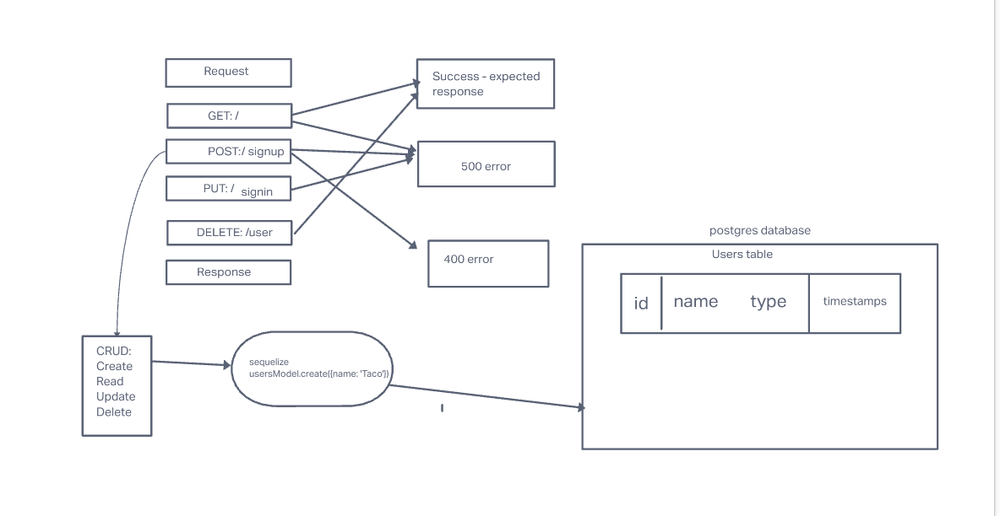

# auth-api

## Project: auth-api

### Author: Jordan Covington

### Problem Domain

Combining multiple repos into an auth-api repo.

### Links and Resources

- [GitHub Actions ci/cd](https://github.com/JMCov/auth-api/actions)

### Setup

#### `.env` requirements (where applicable)

DATABASE_URL

#### How to initialize/run your application (where applicable)

- e.g. `npm start`

#### Tests

fill this in as you see fit
- How do you run tests?
npm test
- Any tests of note?
No
- Describe any tests that you did not complete, skipped, etc
N/A

#### UML

Collaborators:
Ken Holt
Joe Davitt
Adrienne Frey
Martin Hansen